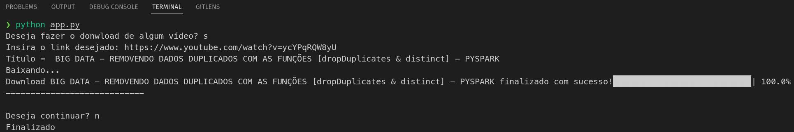

<div id="top"></div>

# Programa para download de vídeos no Youtube

Projeto com intuito de automatizar downloads de vídeos no Youtube.

## 🚀 Começando

Essas instruções permitirão que você obtenha uma cópia do projeto em operação na sua máquina local para fins de desenvolvimento e teste.

Consulte **Implantação** para saber como implantar o projeto.

### 📋 Pré-requisitos

De que coisas você precisa para rodar o programa?

```
Python v3.7
```
```
Visual Studio Code (opcional)
```

<p align="right">(<a href="#top">Voltar ao topo</a>)</p>

### ⚙️ Como rodar

Uma série de exemplos passo-a-passo que informam o que você deve executar para ter um ambiente de desenvolvimento em execução.

1. Crie uma venv pelo terminal:
```
virtualenv venv
```
2. Ative a venv:
```
source venv/bin/activate
```
3. Instale o requirements.txt:
```
pip install -r requirements.txt
```
4. No terminal, execute o comando dentro da pasta do projeto:
```
python app.py
```


<p align="right">(<a href="#top">Voltar ao topo</a>)</p>

### Ajustes e melhorias

O projeto ainda está em desenvolvimento e as próximas atualizações serão voltadas nas seguintes tarefas:

- [x] Inserir barra de progresso
- [ ] Selecionar diretório para o download

## 🛠️ Construído com:


<p align="right">(<a href="#top">Voltar ao topo</a>)</p>

## ✒️ Autores

* **Desenvolvedor** - *Trabalho Inicial* - [Diego Policarpo](https://github.com/PolicarpoDi)
